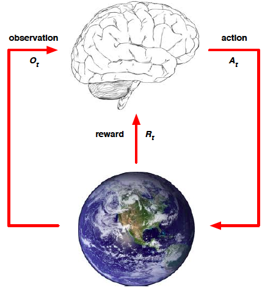

## Introduction to Reinforcement Learning

#### What makes reinforcement learning different from other machine learning paradigms?
- There is no supervisor, only a reward signal
- Feedback is delayed, not instantaneous
- Time really matters (sequential)
- Agent's actions affect the subsequent data it receives

#### Rewards
- A reward is a scalar feedback signal
- Indicates how well agent is doing at step t
- The agent's job is to maximise cumulative reward

#### Sequential Decision Making
- Goal: select actions to maximise total future reward
- Actions may have long term consequences
- Reward may be delayed
- It may be better to sacrifice immediate reward to gain more long-term reward

#### Agent and Environment

#### History and State
- The history is the sequence of observations, actions, rewards  

- What happens next depends on the history
    - Agent selects actions
    - Environment selects observations/rewards
- State is the information used to determine what happens next  

#### Environment State
- The environment state is the environment's private representation
- pick next observation/reward
- not usually visible to the agent
- even if visible, it may contain irrelevant information

#### Agent State
- The agent state is the agent's internal representation
- pick next action
- it is the information used by reinforcement learning algorithms
- it can be any function of history

#### Information State
- An information state (Markov state) contains all useful information from the history. A state S is Markov if and only if  

#### Full observability, Markov decision process (MDP)
- agent state = environment state = information state

#### Partially Observable Environments, Partially Observable MDP
- agent state != environment state

#### Major Components of an RL Agent
1. Policy
    - agent's behaviour function
    - It is a map from state to action
2. Value function
    - how good is each state and/or action
    - Value function is a prediction of future reward
    - Used to evaluate the goodness/badness of states
3. Model
    - agent's representation of the environment
    - model predicts what the environment will do next (state, reward)

#### Exploration and Exploitation  
- __Exploration__ finds more information about the environment
- __Exploitation__ exploits known information to maximise reward
- It is usually important to explore as well as exploit

## References
- [Reinforcement Learning: An Introduction](http://incompleteideas.net/book/bookdraft2018jan1.pdf) - Chapter 1: The Reinforcement Learning Problem
- David Silver's RL Course Lecture 1 - Introduction to Reinforcement Learning ([video](https://www.youtube.com/watch?v=2pWv7GOvuf0), [slides](http://www0.cs.ucl.ac.uk/staff/d.silver/web/Teaching_files/intro_RL.pdf))
